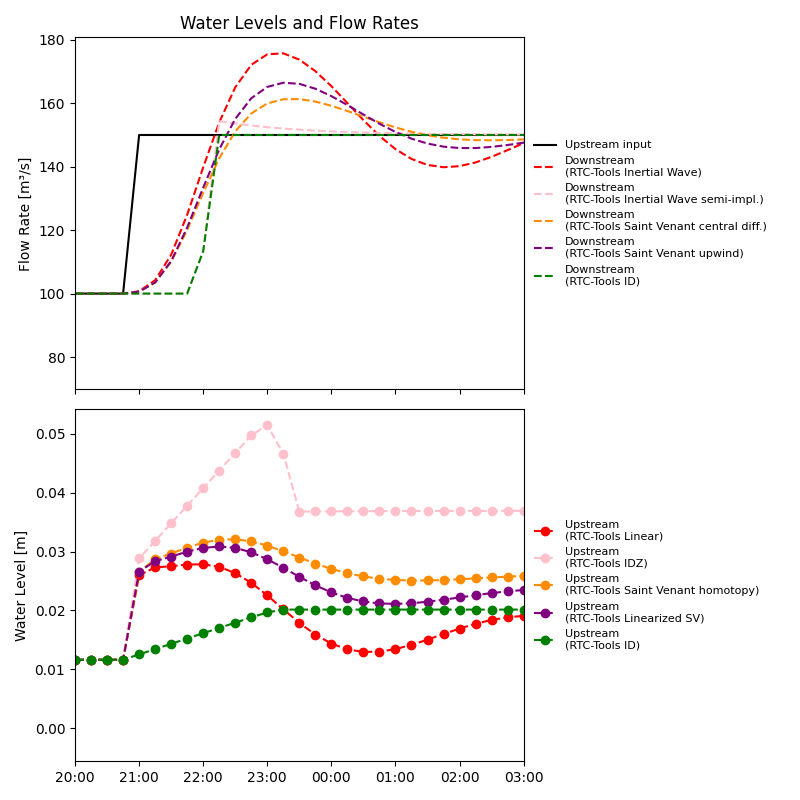
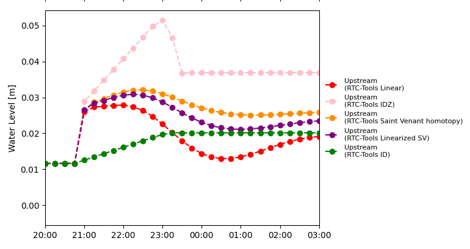

Modeling Waves with different routing algorithms
~~~~~~~~~~~~~~~~~~~~~~~~~~~~~~~~~~~~~~~~~~~~~~~~

In the previous section we saw that RTC-Tools is able to handle non-linear hydraulics
using non-linear optimization. However, it is also possible to approximate the non-linear
routing with different linearizations / approximations. There are two types of approximations in RTC-Tools:
blocks directly providing water level or blocks only providing discharge. This section deals with the first option.

The different channels
----------------------

Open water channels can be characterised by what is the effect of a change of the discharge at a certain point of the channel. For example how the downstream discharge change if we change the upstream discharge. This information is extremely useful if we want to design a controller that controls the downstream discharge by changing the upstream discharge, for example opening there a gate. An example is shown below: the same width, friction, bottom slope and water level, only the length of the channel changes. The dashed line shows the upstream discharge, the solid line the downstream one.

.. list-table::
   :widths: 33 33 33
   :align: center

   * - .. figure:: ../../images/routing_discharge/SVFlowcomparison_routing_0.0_800.png
          :width: 95%
          
          0.8 km long
         
     - .. figure:: ../../images/routing_discharge/SVFlowcomparison_routing_0.0_1000.png
          :width: 95%
          
          1 km long
          
     - .. figure:: ../../images/routing_discharge/SVFlowcomparison_routing_0.0_5000.png
          :width: 95%

          5 km long
          
   * - .. figure:: ../../images/routing_discharge/SVFlowcomparison_routing_0.0_10000.png
          :width: 95%
          
          10 km long
         
     - .. figure:: ../../images/routing_discharge/SVFlowcomparison_routing_0.0_20000.png
          :width: 95%
          
          20 km long
          
     - .. figure:: ../../images/routing_discharge/SVFlowcomparison_routing_0.0_30000.png
          :width: 95%

          30 km long

   * - .. figure:: ../../images/routing_discharge/SVFlowcomparison_routing_0.0_50000.png
          :width: 95%
          
          50 km long
         
     - .. figure:: ../../images/routing_discharge/SVFlowcomparison_routing_0.0_70000.png
          :width: 95%
          
          70 km long
          
     - .. figure:: ../../images/routing_discharge/SVFlowcomparison_routing_0.0_100000.png
          :width: 95%

          100 km long

In a short channel, the downstream discharge is almost the same as the upstream one. the longer the channel the more difference to be seen: first a higher bump: the discharge becomes higher that the maximum of the inflow and then sinks below and then settles at the inflow discharge. If the channel is longer, the initial increase of the downstream dishcarge occurs later (there is time delay), and this bump becomes slower. The longer the channel the shape of the curve transforms to a slowly rising curve from a faster rise. These characteristics do not only depend on the lenght of the channel but also on the water level, discharge, width, friction, buttom slope.

Literature background
---------------------
These channel responses are studied in the literature and they established 4 different groups: short channels without waves (category I, this is the first three figures), short channels with waves (second three figures), middle long channel with waves (no figure), middle long channels (figures 7,8) and very long channels (figures 9). The categories are characterised by the following:

Short channels without waves (:math:`{\chi}` < 0.6 and :math:`{\eta}` > 3):

* The downstream reaction does not exceed the final value
* The downstream reaction is almost the same shape as upstream
* There is no time delay

Short channels with waves (:math:`{\chi}` < 0.6 and :math:`{\eta}` < 3):

* The downstream reaction first exceeds the final value
* The channel is relatively small
* Theres is no time delay

Middle long channels without waves (0.6 < :math:`{\chi}` < 1.35 and :math:`{\eta}` > 3):

* The downstream reaction rises fast and can exceed the final value
* There is time delay

Middle long channels with waves ( 0.6 < :math:`{\chi}` < 1.35 and :math:`{\eta}` < 3):

* The downstream reaction first exceeds the final value
* Theres is time delay

Long channels without waves (:math:`{\chi}` > 1.35 and :math:`{\eta}` > 3):

* The downstream reaction does not exceed the final value
* The downstream reaction rises slowly
* There is considerable time delay

Depending on the type of the channel, the models for RTC-Tools can be chosen. How to know which type is a given channel? There are two ways to know it: the first option, is to plot the step response, with other words how the downstream water level (or discharge) changes with a sudden increase of the upstream discharge (or the other way around, depending what we would like to control). This plot can be done using measurements, or with any software that can numerically solve the Saint-Venant equations or with RTC-Tools, like in this example. The second method is calculate those parameters in brackets that only depend on the geometry and the discharge and water level. The formulas are given in [Horvath2024]_.

On channel responses
--------------------

First of all, you should have an idea of the responde of your channel between the points you want to control and the points are taking action. In this example we want to control the upstream water level by changing the upstream flow. (Most of the time there is a distance between these two points). Plot how your channel reacts if you immediately raise the control (e.g. discharge). Probably the controlled variable (here water level) will start to move after some time, will move up to a point and either settles there or moves down again and settles after some wavy movements. If the time it settles to a final level is smaller then the time step of your controller, then use ID model. If not, then there is a point to look into the dynamical models.

Depending on the reaction of the response, the channel can have three different kind of respondes: wavy firt order, first order, second order, second order with delay depending on the "relative length" of the channel. Based on the publicaiton *, for the first two types you can use IDZ, and for the last two types you can use Linearized Saint-Venant. How to check which category your channel belongs? Either inspect the plots, or calculate the give constants in *.

The figures below show the water level changes in a channel as a result of 50m3/s discharge change. The channel is 100 m wide, and has Manning's coefficient of 0.045. The responses are shown for different lenght channels. You can see that the first two channels the water level first increases above the final value. The longer the channel the slower the water level reaches the final state.

.. list-table::
   :widths: 33 33 33
   :align: center

   * - .. figure:: ../../images/routing/SVcomparison_routing_0.0_5000.png
          :width: 95%
          
          5 km long
         
     - .. figure:: ../../images/routing/SVcomparison_routing_0.0_10000.png
          :width: 95%
          
          10 km long
          
     - .. figure:: ../../images/routing/SVcomparison_routing_0.0_20000.png
          :width: 95%

          20 km long
          
   * - .. figure:: ../../images/routing/SVcomparison_routing_0.0_30000.png
          :width: 95%
          
          30 km long
          
     - .. figure:: ../../images/routing/SVcomparison_routing_0.0_50000.png
          :width: 95%
          
          50 km long

     - 

The figures below show the water level changes in a channel as a result of 50m3/s discharge change. The channel is 100 m wide, and is 20000 km long. The responses are shown for different lenght channels. You can see that the first two channels the water level first increases above the final value. The longer the channel the slower the water level reaches the final state.

.. list-table::
   :widths: 33 33 33
   :align: center

   * - .. figure:: ../../images/routing_friction/SVcomparison_routing_0.0_0.01.png
          :width: 95%
          
          0.01 rougness, cement
         
     - .. figure:: ../../images/routing_friction/SVcomparison_routing_0.0_0.03.png
          :width: 95%
          
          0.03 Natural stream with little vegetation
          
     - .. figure:: ../../images/routing_friction/SVcomparison_routing_0.0_0.045.png
          :width: 95%

          0.045 Rocky bed
          
   * - .. figure:: ../../images/routing_friction/SVcomparison_routing_0.0_0.08.png
          :width: 95%
          
          0.08 Wetland
          
     - .. figure:: ../../images/routing_friction/SVcomparison_routing_0.0_0.1.png
          :width: 95%
          
          0.1 Residential area

     - 

Finally, we look at the effect of the width. 

.. list-table::
   :widths: 33 33 33
   :align: center

   * - .. figure:: ../../images/routing_width/SVcomparison_routing_0.0_30.png
          :width: 95%
          
          30 m
         
     - .. figure:: ../../images/routing_width/SVcomparison_routing_0.0_50.png
          :width: 95%
          
          50 m
          
     - .. figure:: ../../images/routing_width/SVcomparison_routing_0.0_100.png
          :width: 95%

          100 m
          
   * - .. figure:: ../../images/routing_width/SVcomparison_routing_0.0_500.png
          :width: 95%
          
          500 m
          
     - .. figure:: ../../images/routing_width/SVcomparison_routing_0.0_1000.png
          :width: 95%
          
          1000 m

     - 

It can be seen that depending on these parameters either we get a wavy response, a (slowly or less slowly) increasing curve.

How to control such channel
---------------------------

In this example we compare 4 routing methods:
 * Full non-linear Saint-Venant (as reference)
 * Built in linear block for Saint-Venant (deprecated)
 * Linearized Saint-Venant
 * Integrator Delay Zero

In this section we explain how to set up a model with each method and we discuss
the advantages and disadvantages.

How are these models used in RTC-Tools? Make a picture explaining it, and the consequences of the modelling. Suppose that you increased the upstream discharge by 50m3/s and you have the resulting water level increase as shown in :ref:`comparison_routing`. Now we need to think backwards. As we want to control the water level, we ask, how much extra dicharge do w need to reaise the water level by 2.6 cm? The "reality" (the best approximation) is the Saint-Venant equations. This shows that if the discharge increases 50m36s hte water level first increases 3 cm and settles at an increaes around 2.6 cm. If we just care about the final water level and we do have some buffer to catch that wave, the answer is 50m/s. If we do not have any buffer and want to avoid that the water level in any moment goes over the desired level, probably it is somewhat less than 50m3/s. Suppose we do have that small buffer. What happens in our controller? He uses his estimation of water level to find the right discharge. Using Linearized Saint-Venant, he will ask slightly more discharge. Using ID, he will ask much more discharge and might results in too high water levels in the first step. (He will correct it at the next operation hour, but it might already be too late). Using IDZ, he will underestimate the discharge. He will correct for it in the next moment to act, but the controller might be too slow. As a summary, for a "wavy" channel, to be on the conservative side it is better to use Linearized Saint-Venant (maye IDZ), but not ID.

Let's see an example without waves.

.. _comparison_routing:

   
   Figure 1

Which model to chooes in a one sentence?
----------------------------------------
If you have waves (:math:`{\eta}` < 3, check this with a bit of range of water depth and discharges) or a very long channel (:math:`{\chi}` > 1.35, check this with a bit of range of water depth and discharges), choose linearized Saint-Venant, otehrwise choose IDZ.

.. math::
   :label: eq-dprop

   D_p = \frac{Q}{2 B S_f}
   
.. math::
   :label: eq-cprop

   C_p = \frac{5Q}{3A}-\frac{4Q}{3B}\frac{1}{2H+B}   
 
.. math::
   :label: eq-etaprop

   \eta = 3\zeta = \frac{3\sqrt{2g} Q L}{4 C^2 R B H^{3/2}}

.. math::
   :label: eq-chiprop

   \chi = \frac{3 L}{10} \frac{C_p}{D_p}

These formulas are given for rectangular channels. 

Decision Tree
-------------

Routing model decision tree::

    Start
    |
    +-- Is your model mixed-integer?
    |   |
    |   +-- Yes → Use one of the linear routings
    |   |
    |   +-- No
    |       |
    |       +-- Do you use ensembles?
    |           |
    |           +-- Yes → Use one of the linear routings
    |           |
    |           +-- No → Do you have concerns about runtime?
    |               |
    |               +-- Yes → Use one of the linear routings
    |               |
    |               +-- No → Use homotopy

Test your channel with different routings
-----------------------------------------

Specify the geometry of your model in ``param_modifier.py``. Next, run
``example.py`` to execute the model, and then use
``channel_pulse_results.py`` to generate the comparison plots.

To investigate how the results change for different channel lengths or
water depths, use ``batch_runner.py``. This script automatically updates
the model parameters, runs the simulations, and generates the
corresponding plots.

.. note::

     The nominal depth/level is currently interpreted differently by different blocks, which can be confusing. In ``LinearizedSV``, ``h_nominal`` represents the water depth, whereas in ``IDZ``, ``H_nominal`` represents the water level. These differences can be observed and tested using sufficiently deep channels.

.. [Horvath2024] Horváth, K., van Esch, B., & Pothof, I. (2024).
   *How to Choose Suitable Physics‐Based Models Without Tuning and System Identification
   for Model‐Predictive Control of Open Water Channels?*
   Water Resources Research, 60(4), e2023WR035687.