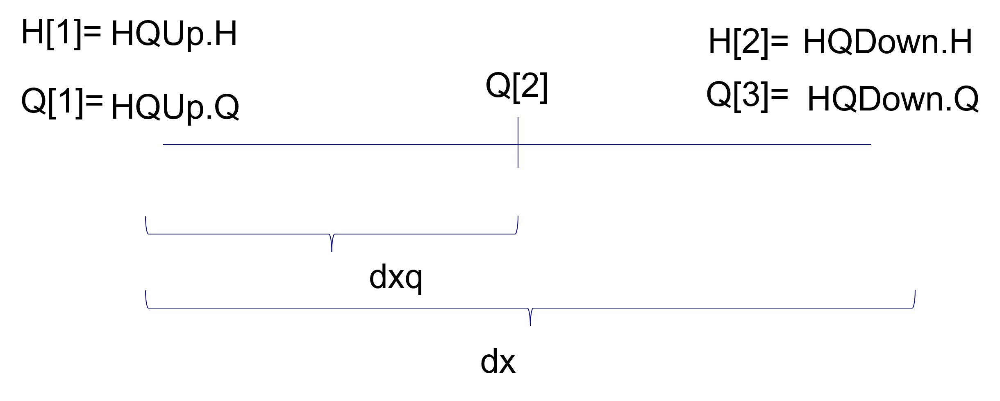
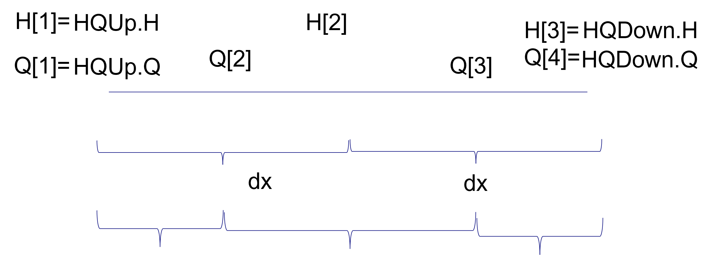
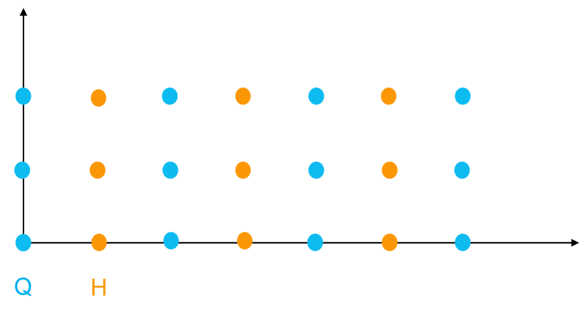
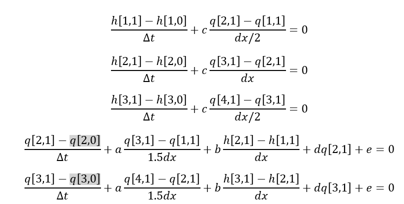
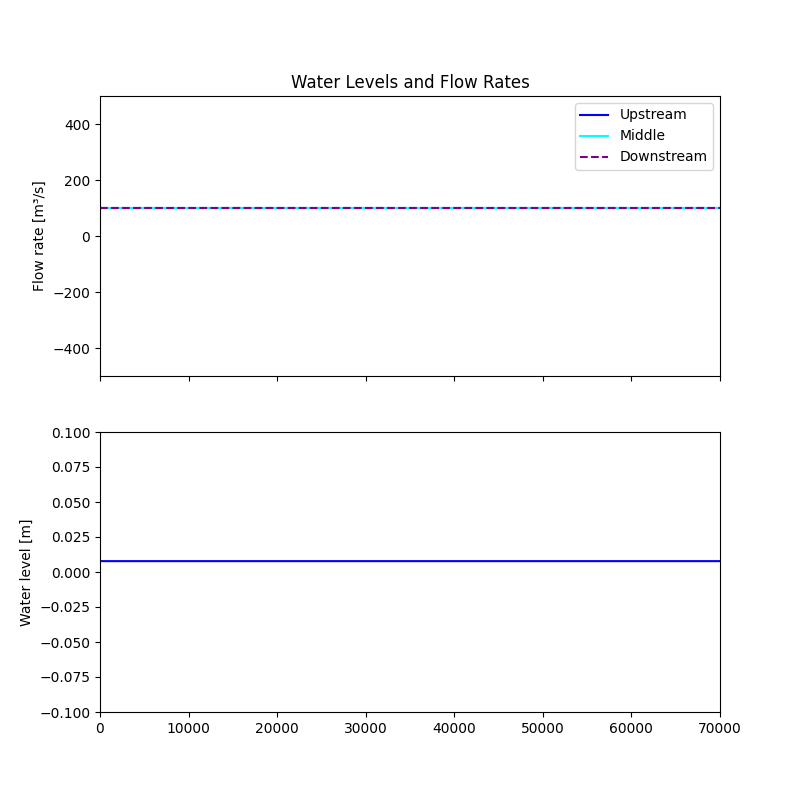
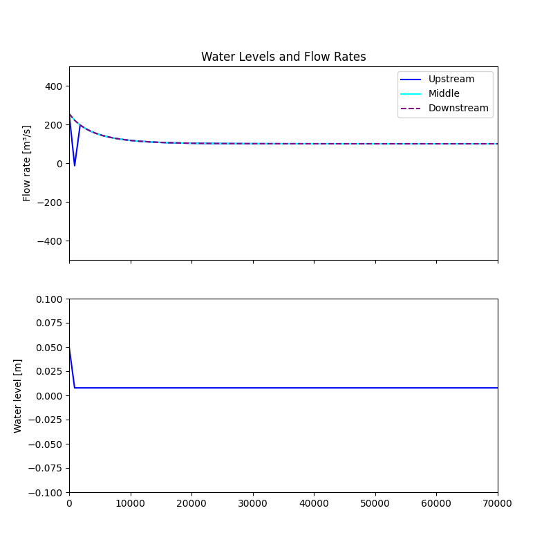
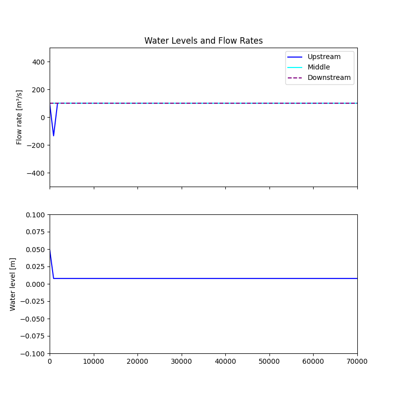

Initialization of spatially distributed blocks 
~~~~~~~~~~~~~~~~~~~~~~~~~~~~~~~~~~~~~~~~~~~~~~

The **Linearized Saint-Venant** block is an alternative to the non-linear homotopic block. Both represent spatially distributed hydraulic systems. For distributed hydraulic models, and especially for looped networks, proper initialization is essential. An inappropriate initial state can leave the model with too many degrees of freedom, causing it to converge to solutions that do not represent the actual hydraulic conditions. As a result, operational advice may become unreliable and can significantly under- or overestimate the required control actions.

This page discusses the initialization of distributed Saint-Venant blocks and provides guidance on obtaining a physically consistent initial state for optimization and simulation.

Spatial discretization of RTC-Tools homotopic and LinearisedSV
--------------------------------------------------------------

Both blocks are using a staggered grid: the Q and H are calculated at different points. The user gives the number of H-s in as node number, and the number of Q nodes is one more. :ref:`discretization_2nodes` shows the discretization if the node number is set to two (smallest possible number). In that case the variables are the following:

* number of H nodes: n_level_nodes = 2
* number of H nodes: n_level_nodes +1 = 3
* dx = length / (n_level_nodes – 1), so it is L if n_level_nodes = 2
* _dxq = dx/2, .., dx.. , dx/2, in this case _dxq= L/2, L/2

.. _discretization_2nodes:

   
   Figure 1: Spatial discreatization in RTC-Tools using 2 nodes

.. _discretization_3nodes:

   
   Figure 2: Spatial discreatization in RTC-Tools using 3 nodes

Similarly, written for 3 nodes is shown in :ref:`discretization_3nodes`. Both homotopic linear and linearized SV has the same way. LinearisedSV needs minimum 4 level nodes due to the code formulation. That might be generalized later. 

.. note::

    When working with distributed elements, it is always a good practice to visualize all the H and Q when building a model to be able to judge if the model is realistic. 

Initial Conditions and Degrees of Freedom
-----------------------------------------

In a traditional simulation model, a channel requires an initial state and two boundary conditions. The initial state consists of the discharge (``Q``) and water level (``H``) values at all discretization points at the start of the simulation. Typical boundary conditions are, for example, an upstream discharge and a downstream water level.

In an optimization model, the same Saint-Venant equations are solved. However, any variable that is not fixed by measurements, boundary conditions, constraints, or objectives becomes a degree of freedom. The optimizer will assign values to such variables if this helps improve the objective function, regardless of whether these values represent the actual hydraulic state of the system.

As a result, it is crucial to limit the degrees of freedom during initialization. If the initial state is insufficiently constrained, the optimization may exploit unrealistic initial water levels or discharges to obtain a better objective value. The resulting operational advice may then be inconsistent with the current hydraulic situation and therefore be unreliable.

The remainder of this page discusses how to obtain a physically consistent initial state while avoiding unnecessary constraints. First, a brief overview of the theory behind the distributed Saint-Venant equations is given.

Example using three level nodes, fixing the initial values
----------------------------------------------------------

Suppose we have three water-level nodes as shown in :ref:`staggered_grid_3` and the corresponding simplified equations in :ref:`equations_3_nodes`. Although these equations represent a simplified version of the linear model, the variable locations and relationships are identical to those in the non-linear model.

The set of five equations contains twelve variables: five at the initial time level, ``h[1,0]``, ``h[2,0]``, ``h[3,0]``, ``q[2,0]``, and ``q[3,0]``, and seven at the first time level, ``h[1,1]``, ``h[2,1]``, ``h[3,1]``, ``q[1,1]``, ``q[2,1]``, ``q[3,1]``, and ``q[4,1]``. This gives twelve unknowns and five equations, resulting in seven degrees of freedom.

For the first time level, one boundary condition can be specified while the other may be left free for the optimizer. For example, a common approach is to fix the upstream boundary (for example, by imposing a closed boundary with ``Q = 0``) while leaving the downstream boundary, such as a pump or sluice, free to be optimized. This leaves five initial values that must be provided. In this example, these could be all ``Q`` and ``H`` values at time level zero, although alternative formulations are possible, such as specifying derivatives instead of some of the state variables.

For subsequent time steps, the five variables from the previous time step are known. Consequently, seven unknowns remain and are governed by five equations, leaving two additional conditions to be specified. In a simulation model, these would typically be provided as two boundary conditions.

.. _staggered_grid_3:

   
   Figure 3: Staggered grid using three level nodes
   
.. _equations_3_nodes:

   
   Figure 4: Equations using three level nodes
   
Possible initialization options: steady state
---------------------------------------------

Suppose we do not know or we do not want to provide all initial conditions: then we can start from steady state. Instead of defining the initial Q-s and H-s, we can set the initial derivatives to zero, dus we are looking for an initial steady state. In this case it means adding 5 equations. We still have the freedom to add the two boundary conditions: in that case we can only add one Q that will be the discharge in the whole system and an H (anywhere in the system, and the rest will be calculated). Alternatively, we can add 2 H-s and then the Q value is determined. This hold for the 3-node example. For a 2-node exapmle, in a steady state case there are 3 equations, 3 variables on the zero level, 5 on the first level. Setting the 3 initial derivatives to zero it will leave 2 degrees of freedom, just like in the 3 node case. 

Suppose that not all initial conditions are known, or that we prefer not to specify them explicitly. In that case, the model can be initialized from a steady state. Rather than prescribing the initial ``Q`` and ``H`` values, the initial time derivatives can be set to zero, meaning that the model is forced to start from a stationary hydraulic condition.

For the three-node example, this adds five additional equations, one for each state derivative that is fixed to zero. The two remaining degrees of freedom can then be used to define boundary conditions. For example, a single discharge value can be prescribed. Because the system is in steady state, this discharge applies throughout the channel. In addition, one water level can be specified at any location in the system, with all remaining water levels following from the equations.

Alternatively, for the two-node case after setting all initial derivatives to zero, on discharge and one singel water level can be defined. Thus just like in the case of three-nodes, this property is independent of the number of the discretization points.

Comparing Initialization Approaches
===================================

We have discussed two approaches for initializing a distributed Saint-Venant model: providing all initial ``Q`` and ``H`` values, or assuming an initial steady state. Both approaches have advantages and disadvantages, and in practice a mixed approach is often preferred.

Let us first consider the case where all initial ``Q`` and ``H`` values are prescribed. In reality, these values are rarely known exactly. Even when measurements are available, forcing the model to match them exactly may be problematic. The optimizer must find a solution to the Saint-Venant equations that satisfies these prescribed values, but the model is only an approximation of reality. Errors in cross-section geometry, neglected two-dimensional effects, uncertainty in roughness coefficients, and spatial discretization errors can all contribute to inconsistencies between the model and the measurements.

As a result, the model may compensate by generating large initial derivatives. Physically, this corresponds to the generation of artificial waves that propagate through the system. The risk of such spurious waves is particularly high when the first optimization timestep is also used as the first operational timestep, which is often the case. Note that with this approach all initial state variables must be specified. For channels with multiple internal nodes, both water levels and discharges must be prescribed at every node.

Steady-state initialization is generally more robust because it guarantees that no artificial waves are introduced at the start of the simulation. The resulting hydraulic state is internally consistent with the Saint-Venant equations and therefore provides a stable starting point for the optimization.

However, a steady-state assumption is not always appropriate. If the system is known to be far from equilibrium, for example during rapidly changing flows, pump transitions, gate operations, or flood events, a steady-state initialization may fail to represent the actual hydraulic situation. In such cases, valuable information from field measurements, particularly water-level observations, would be ignored. The resulting initial state may be numerically consistent but physically unrealistic.

For this reason, a mixed approach is often preferable. Rather than fixing all state variables or enforcing a perfect steady state, the initialization can combine measured water levels with constraints on the initial derivatives. This allows the model to remain close to the observed system state while preventing the introduction of unrealistic waves. The optimization is then given sufficient flexibility to reconcile measurements with the hydraulic equations without exploiting unrealistic initial conditions.

Mixed approach
--------------

A third, mixed approach is also possible. Instead of enforcing a full steady state by setting all initial derivatives to zero, only the discharge derivatives can be constrained to be small (or equal to zero). This still allows different discharge values along the channel, which is often more realistic than assuming a perfectly uniform flow distribution.

For the three-node example, this leaves four degrees of freedom. Two correspond to the upstream and downstream boundary conditions. The remaining two depend on the choice of boundary conditions. For example, if the upstream boundary condition is a water level, one additional discharge can be specified. The remaining variables then follow from the equations.

In this formulation, the initial hydraulic state is fully defined. However, in practice the goal is often not to define a unique state exactly, but rather to guide RTC-Tools towards a physically realistic state while avoiding excessive freedom for the optimizer. Finding the right balance can be challenging.

One practical approach is to impose bounds around measured water levels and to constrain the initial discharges to a plausible range. In this way, the initialization remains close to the observed system state without forcing the model to exactly match measurements that may be inconsistent with the Saint-Venant equations.

Some important observations are:

* Water levels are generally more sensitive than discharges. The same water level profile may correspond to very different discharge distributions. Therefore, it is usually not good practice to enforce measured water levels exactly.
* Always validate the initialization results by inspecting all ``Q`` and ``H`` values and checking whether the model produces a reasonable hydraulic state when no operational changes are applied.
* Before investing effort in initialization, consider whether a spatially discretized model is actually required. In some cases, a simpler model may provide sufficient accuracy with fewer initialization challenges.

In many practical applications, the most robust strategy is to search for a state that is both close to steady state and close to the available measurements. This can be achieved by constraining derivatives to remain within a specified range around zero, while applying similar bounds around measured values. Measured quantities can also be represented as high-priority goals rather than hard constraints, allowing the optimizer to reconcile measurements with the hydraulic equations when perfect agreement is impossible.

Because some degrees of freedom remain available, additional system knowledge can be incorporated. For example, an upstream discharge measurement may be prescribed, a range can be specified for the downstream discharge, and bounds can be applied to selected water-level measurements. This often leads to a physically realistic and numerically robust initialization.

Regardless of the chosen approach, initialization should always be tested thoroughly. Small changes in the initialization strategy can have a significant impact on the resulting flow distribution, water-level profile, and ultimately on the operational advice produced by the optimization.

.. note::

    For looped networks there is even less degree of freedom, you should think similarly. Storage elements also influence this, therefore we suggest to always set zero (or small) initial flow to these elements. 

Example
-------

Consider a channel for which the downstream water level is prescribed as a boundary condition and the downstream discharge has a target value of 100 m³/s. For this discharge, the corresponding steady-state upstream water level is known to be 0.00776 m.

The examples below compare three situations: an initialization at the correct steady state, an initialization using a measured water level of 0.05 m, and an initialization without a steady-state assumption. The optimisation goal in all cases is to achieve the steady-state water level.

The downstream water level is prescribed as a boundary condition and is therefore fixed from the very first timestep onward. All other state variables are left free. An objective is defined on the upstream water level, which is required to reach 0.00776 m.

The model must determine the corresponding upstream discharge. For a channel with three water-level nodes, there are three water levels and four discharges. Because the downstream water level is fixed by the boundary condition, two water levels and four discharges remain free.

.. _Figure_st100q:

   Figure 4: Steady-state initialization with a discharge of 100 m³/s.

.. _steady5h:

   Figure 5: Steady-state initialization with a measured water level.

.. _Figure_give:

   Figure 6: Initialization without a steady-state assumption.

The first case, shown in :ref:`Figure_st100q`, demonstrates the ideal situation. The steady-state discharge corresponds exactly to the target water level, resulting in a smooth initialization and a smooth transition into the optimization horizon. No significant control actions are required at the first timestep.

However, if the target water level differs from the steady-state (0.02 m) water level used for initialization, the behaviour changes considerably. In the example shown in :ref:`steady5h`, the optimizer immediately attempts to move the system towards the target state. As a result, a very aggressive control action is taken at the first timestep.

Finally, if no steady-state condition is imposed during initialization, as shown in :ref:`Figure_give`, the model must determine all unconstrained state variables itself. Although this may lead to a feasible solution, it can also result in large discontinuities in both water levels and discharges at the start of the simulation. In this example, a significant drop in water level and discharge occurs during the first timestep, indicating that the initial hydraulic state is inconsistent with the optimisation objectives and boundary conditions.

These examples illustrate that both the quality of the initialization and its consistency with the optimisation goals are important. A steady-state initialization can prevent spurious waves, but only if the chosen steady state is representative of the desired operating condition.

Simulation
----------
Initialization for simulation models will be separately discussed.
