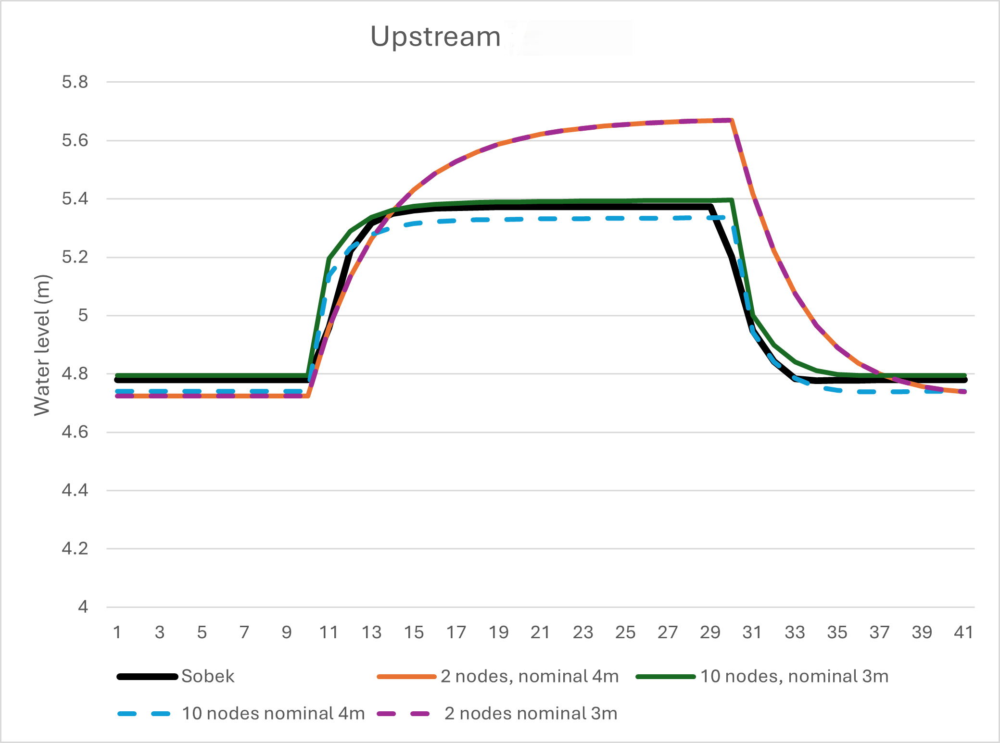
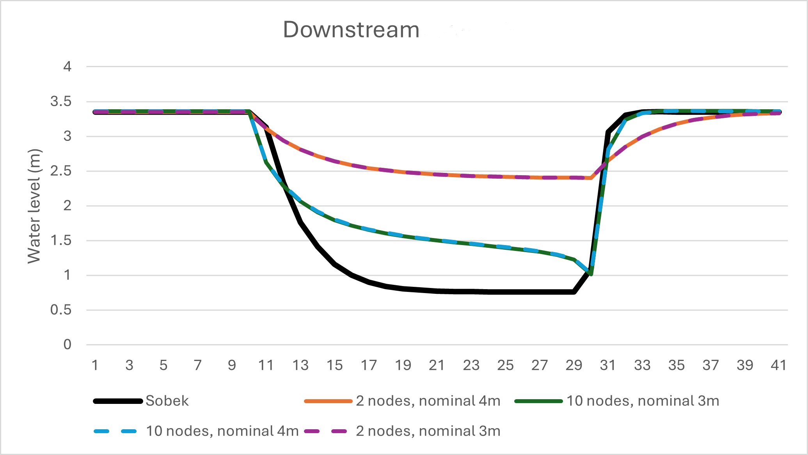

Validation of current Homotopy Example Model
============================================

This section compares the current implementation of the homotopy approach (also referred to as continuation mehtod) for the full high-resolution non-linear solution of the Saint-Venant Equations with a reference solution. The test case :ref:`channel_pulse` is solved with the homotopy method and the results are compared with the solution obtained with a corresponding model built with the SOBEK hydraulic modelling suite. 

-------------------------
Model 
-------------------------

The channel data is the following::

    H_b_down = 0
    H_b_up = 2
    Q_nominal = 100
    friction_coefficient = 0.02
    length = 10000
    width = 30

Using the node_number property, different discratizaitons are tested using the HomotopicLinear branch:

.. code-block:: modelica

  Deltares.ChannelFlow.Hydraulic.Branches.HomotopicLinear Channel(H_b_down = 0, H_b_up = 0.2, 
  Q_nominal = 100, friction_coefficient = 0.02, length = 10000, n_level_nodes = 10, theta = theta,
  uniform_nominal_depth = 3.154, use_inertia = true, use_manning = true, use_upwind = false,
  width_down = 100, width_up = 100, rotation_deg = 0.0, wind_stress_u = reach_1_stress_u, 
  wind_stress_v = reach_1_stress_v);

As boundary conditions, an upstream and downstream wave of 150 m³/s is set. The corresponding water levels are compared.

To analyze the effect of the spatial discretization and the nominal value for the water level, four variants of the homotopy model are evaluated. Two different spatial discretization settings, the full (10-node) and the sparse (2-node, typically used operationally), are each combined with a different nominal value for the water level:

- 10 nodes, nominal value for water level 3 m  
- 10 nodes, nominal value for water level 4 m  
- 2 nodes, nominal value for water level 3 m  
- 2 nodes, nominal value for water level 4 m  

The homotopy procedure starts with :math:`\theta = 0`, which is the full linear simplification. The value :math:`\theta` is increased gradually with default step size for :math:`\theta` towards the full non-linear formulation of the Saint-Venant equations. 

-------------------------
Results
-------------------------

The water level time series for the downstream end and for the upstream end of the channel are shown in the following figures.

   
.. _Upstream_150:

.. _Downstream_150:

-------------------------
Analysis
-------------------------

The full discretization with 10 nodes represents the water level well. SOBEK
calculates a 0.59 m water level change due to the wave inflow, while the homotopy model with 10 node discretization
calculates the water level change to 0.60 m. 

The water level results from the homotopy model with the sparse discretization match the SOBEK solution less well. The water level change is 0.94 m. This shows the **strong influence of the spatial discretization**.

For the downstream end of the channel, the results from the homotopy model with full discretization match the reference solution obtained with SOBEK better than the sparse discretization. However, the results still differ here more than in the upstream end of the channel. 

The different **nominal value** has **negligible influence** when using two
discretization points, and only a little influence when using 10 points. 

.. note::

    To avoid errors due to this phenomenon (which could
    also be investigated), we gave an initial state that is the same as the Sobek
    model.

-------------------------
Summary
-------------------------

The model shows high sensitivity to the spatial discretization, so it is important to consider 
the effects that discretization may have on the results.
The model is also sensitive to the choice of the nominal values, especially when the actual value shows large variations. 