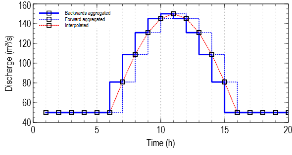

Working with time series
========================

Interpretation of time series values
------------------------------------

The aggregation of discrete non-instantaneous values (often discharge) in RTC-Tools is backwards. This means that a value which is assigned to the current point in time is valid from the previous time step :math:`t-1` up to the current time step :math:`t`.

	Different aggregation methods for discharge time series: backwards, forward and interpolated. Backwards aggregated and forward aggregated interpretation of a discrete discharge time series and linear interpolation between data points.
	
The mass balance for an element that contains volume calculates as follows:

.. math:: V_t=V_{t-1} + Q_{\mathrm{in,}t}+Q_{\mathrm{forcing,}t}-Q_{\mathrm{out,}t}

Where  :math:`V` is the volume, :math:`Q_\mathrm{in}` is the inflowing discharge (inflow is positive), :math:`Q_\mathrm{out}` the outflowing discharge (outflow is positive), :math:`Q_\mathrm{forcing}` is forcing to account for extractions from the reservoir (inflow into the reservoir is positive) and :math:`t` is the current point in time. 

Note that there are other water-related models that use forward aggregation (see e. g. :footcite:t:`loucks_water_2017`, equation 3.8). Hydraulic models with a numerical scheme that uses an implicit time representation often use the backwards aggregation, while hydrological models and water resources models typically apply forward aggregation. For each model the values must be interpreted according to how they are treated in the model. From a physical point of view, the backwards aggregation makes sense when model data is compared with observed data, because observed values say more about the past than about the future. Forecasts usually aim to continue the history, so in an operational context the backward aggregation is in general considered as appropriate, too. 

For RTC-Tools the backward optimization has another advantage: RTC-Tools needs derivatives for optimization. With the backwards aggregation, RTC-Tools can compute the derivatives for the first unknown time step :math:`t = t_1` with the initial conditions at time step :math:`t_0=t-1` and does not need additional data from a time step prior to the initial conditions. In simulations, the inflow assigned to the initial time step :math:`t_0` is usually not used by RTC-Tools. For states like a reservoir volume, an initial condition is required though. 	

Recommendations for naming of time series
-----------------------------------------

The name of a time series should represent location (e. g. *Reservoir010* or *TroutLake*) and parameter (e. g. *volume*, *elevation*, *water level*, *h*, *discharge*, *release*, *Q*, *Qspill*, *Qturbine*, *hobs*, *Qobs*).

Use one underscore to split between location and parameter. Example: ``Reservoir010_Qspill``. Avoid multiple underscores (``Reservoir_010_Q_spill`` or ``Reservoir010_Q_spill``) to enable easy post processing of time series.

Definition of time series
-------------------------

Time series are in principle defined in Modelica with the help of the modelica statements ``input`` and ``output``. 

Time series of type ``input`` are either given as model boundary condition or determined within the optimization. 

An example for a timseries definition that is used as a boundary condition is:

.. code-block::

	input Modelica.Units.SI.VolumeFlowRate Reservoir010_Qin(fixed = true);

This time series could represent the inflow to a reservoir *Reservoir010* for a certain inflow scenario, all values are known prior to the model execution and specified in the corresponding input file. The ``fixed=true`` attribute indicates this.

The following time series definition is an example for a time series that contains values of an optimization variable: the reservoir release. From a user perspective, this is a primary model output. Internally, however, the time series values are determined within the optimization procedure prior to the solution of the model equations.  

.. code-block::

	input Modelica.Units.SI.VolumeFlowRate Reservoir010_Qrelease(fixed = false, min = 0.0, nominal = 3.0, max = 6.5);
	
The ``fixed=false`` attribute indicates that the time series values are not known prior to the model execution, but determined during the model execution. The ``min`` and the ``max`` statement define the bounds of this optimization variable, the ``nominal`` value is used for scaling and should represent a typical value. 

Note that in RTC-Tools simulation models it does not make a difference if an input time series is defined as ``fixed=true`` or ``fixed=false``. 

With the optimal reservoir release, which is determined by the optimization, and the reservoir inflow, which is given as boundary condition, the reservoir volume can be computed. The reservoir volume is defined as output time series. 

.. code-block::

	output Modelica.Units.SI.Volume Reservoir010_V;

Values for time series of type ``output`` are computed within the model solution by solving the model equations that are specified in Modelica or executing the model's Python code. 

Morew examples for time series definition can be found under :ref:`Optimization examples` and :ref:`Simulation examples`. 

The result vector
-----------------

The result vector of an RTC-Tools model can be extracted in the Python code as follows:

.. code-block::

	results = self.extract_results()

Time series in the result vector can be modified:

.. code-block::

	results['Timeseries_P'] = power

Output time series missing?
---------------------------

RTC-Tools reduces the number of variables in order to improve computational efficiency. Not all variables are present at all times. If a time series is missing, add the output time series with the method ``get_output_variables(self)``. An example:

.. code-block::

    def get_output_variables(self):
        output_variables = super().get_output_variables().copy()
        for res in self.reservoirs:
            output_variables.extend(['{}_V'.format(res), '{}_Q_spill'.format(res), '{}_Q_turbine'.format(res)])
        return output_variables

Setting and getting time series values in Python
------------------------------------------------

Introduction
^^^^^^^^^^^^

Both simulation and optimization utilize the ``io`` Datastore object from the ``storage.py`` module. When using ``self.io.get_timeseries()`` or ``self.io.set_timeseries()``, you are accessing the methods from the Datastore object, which is the same for both optimization and simulation. However, when using the class wide methods ``get_timeseries`` and ``set_timeseries`` (without the ``.io``), differences occur. See the two sections below for the difference in that case

get_timeseries
^^^^^^^^^^^^^^

When using ``get_timeseries`` directly on ``self``, it refers to the ``get_timeseries`` and ``set_timeseries`` from one of the input-output mixins.

For optimization, this ``get_timeseries`` is implemented in the ``io_mixin``. The mixins ``csv_mixin``, ``pi_mixin``, and ``netcdf_mixin`` all inherit it, making it universally accessible. This version, without the ``io`` prefix, serves as a wrapper around the one from the Datastore (where ``get_timeseries_sec`` provides times in seconds):

.. code-block::

	def get_timeseries(self, variable: str, ensemble_member: int = 0) -> Timeseries:
		return Timeseries(*self.io.get_timeseries_sec(variable, ensemble_member))

For simulation, only ``pi_mixin`` defines it, not ``csv_mixin``. Hence, it is exclusively available through ``pi_mixin``. The ``get_timeseries`` here is also a wrapper around ``io.get_timeseries``, but the return type differs: 

.. code-block::

	def get_timeseries(self, variable):
		values = self.io.get_timeseries(variable)
		return values

set_timeseries
^^^^^^^^^^^^^^

For ``set_timeseries``, the situation is a bit more complicated. Similar as with ``get_timeseries``, in simulation mode ``set_timeseries`` is only present in ``pi_mixin``. For optimization, it is defined in both ``io_mixin`` and ``pi_mixin``, with part of the functionality residing in ``pi_mixin``.

Comparing the two implementations of ``set_timeseries`` (simulation from ``pi_mixin`` and optimization from the combination of ``pi_mixin`` and ``io_mixin``), both are very similar. In the end, they both call ``self.io.set_timeseries`` with the variable name and values to set.

The main difference is the additional logic in the optimization variant, invoking the ``stretch_values`` function, ensuring the new series matches the length of all other timeseries in the datastore. The simulation version of ``set_timeseries`` throws an error in case of a mismatch.

The following example shows how values and the unit are assigned to a time series:

.. code-block::

	self.set_timeseries('Reservoir010_volume', computed_values, unit='m3')

The first argument is the TimeseriesID, the second is a vector with values, and the third argument assigns the unit.

.. footbibliography::
